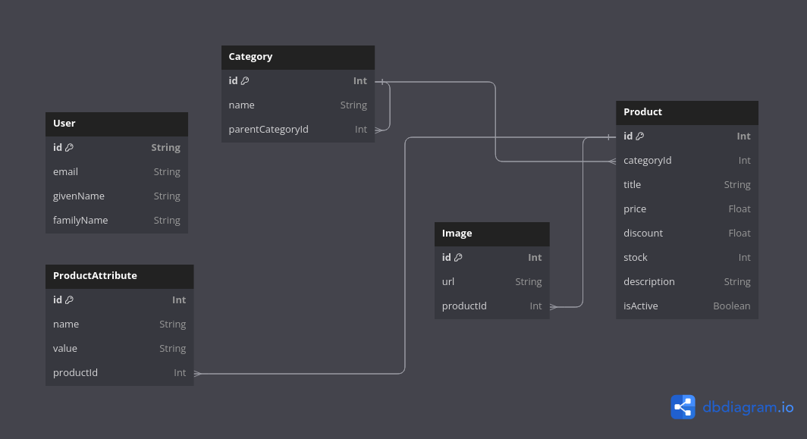

# Tech-Store

Tech-Store is a feature-rich e-commerce website built with Next.js, TypeScript. It includes functionalities such as smart filters, recursive category management, product search, sorting, pagination, user authentication, and more.

## Features

- **Smart Filters**: Filter products by various attributes such as brand, screen size, and more.
- **Recursive Categories**: Manage categories and subcategories recursively.
- **Product Listings**: View product lists with pagination and filters for stock status, discounts, price range, and more.
- **Product Details**: Detailed product pages with images, attributes, descriptions, and purchasing options.
- **Search and Sort**: Search products by keywords and sort them by date, price, and other criteria.
- **Cart**: Add and remove products from the cart, view the total price, and proceed to checkout.
- **User Profile**: Manage user settings, including name, phone number, and delivery address, and view purchase history.

## Technical Stack

- **Framework**: Next.js
- **Database**: Prisma ORM with SQLite (using Turso)
- **State Management**: Zustand and Context API
- **CSS**: Tailwind CSS and Shadcn
- **Authentication**: Kinde Auth

## Setup

### Prerequisites

- Node.js
- pnpm

### Installation

1. Clone the repository:
   ```bash
   git clone https://github.com/mishodzuliashvili/tech-store.git
   ```
2. Navigate to the project directory:
   ```bash
   cd tech-store
   ```
3. Install dependencies:
   ```bash
   pnpm install
   ```
4. Set up environment variables. Create a `.env` file in the root directory and add your configurations.

### Running the Project

1. Run the development server:
   ```bash
   pnpm dev
   ```
2. Open [http://localhost:3000](http://localhost:3000) in your browser to see the application.

### Database Schema

Check the `database.png` file in the project root for the database UML schema.



## Usage

- **Homepage**: Browse products (in different categories) and use filters.
- **Search**: Use the search bar to find products.
- **Product Page**: View product details and purchase options.
- **Cart**: Add/remove products and proceed to checkout.
- **User Profile**: Update personal information and view purchase history.

## License

This project is licensed under the MIT License.
